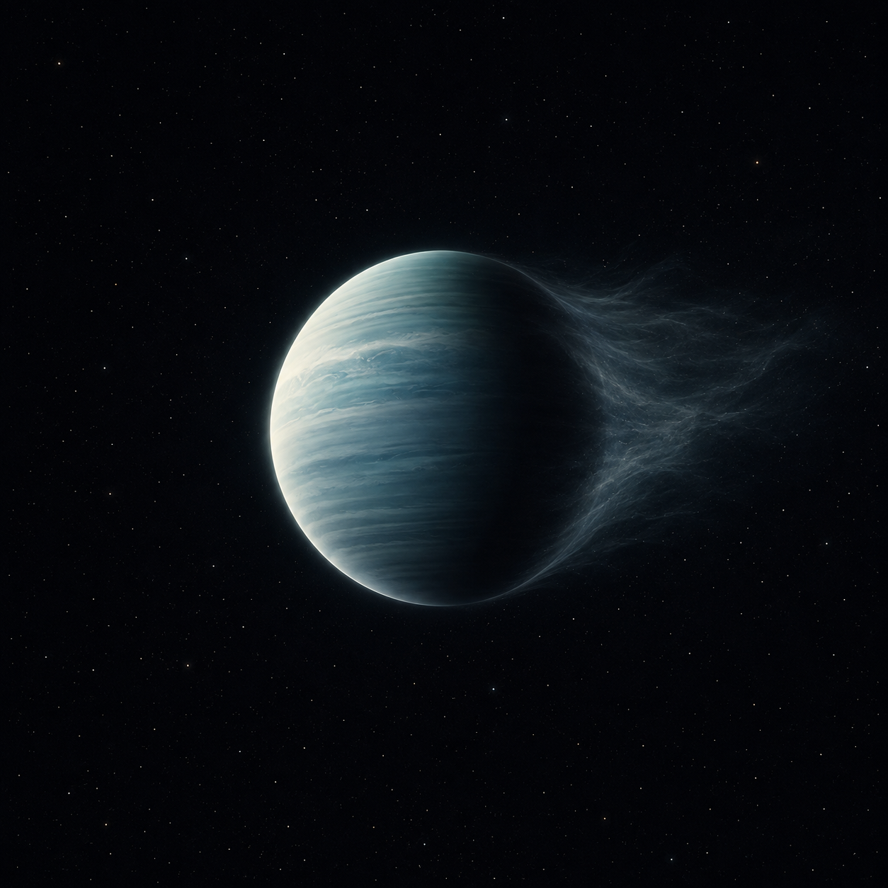

# HAT-P-11b — Exoplanet Atmosphere Report



*AI-generated artist's concept — not a real photograph. See the report for actual CARMENES data.*

A warm Neptune around an active K-dwarf, with a spectrally resolved
detection of escaping helium gas in its published record. This repo
runs its own descriptive statistic on Allart et al.'s (2018) CARMENES
data and compares it to their published measurement rather than
presenting the two as the same thing.

**[Open the full report](index.html)** (open locally in a browser, or serve
with `python -m http.server` from this directory).

## Data sources

- **System parameters** — queried from the NASA Exoplanet Archive TAP
  service (`pscomppars`).
- **Helium transit data** — two files from Zenodo record
  [1473463](https://zenodo.org/records/1473463) (Allart et al. 2018,
  *Science*): a phase-folded relative-flux light curve measured inside the
  He I 10830 Å line, and the per-wavelength-bin spectral excess-absorption
  profile across the triplet, both from CARMENES transit
  observations (3.5 m telescope, Calar Alto Observatory).
- **Analysis** — `scripts/analyze_spectrum.py` computes an
  inverse-variance-weighted in-transit vs. out-of-transit flux comparison
  and prints it next to the paper's own combined value. Run it yourself:

  ```bash
  pip install -r requirements.txt
  python scripts/analyze_spectrum.py
  ```

## Repository structure

```text
index.html              the report webpage
data/                    CARMENES helium transit data (Zenodo 1473463)
scripts/analyze_spectrum.py   in-transit vs out-of-transit analysis
figures/                 generated plot + summary_statistics.csv
tests/                   unit tests + a regression check against the real data
```

## Tests

`tests/test_analysis.py` checks the weighted-mean formula against a
hand-computed case and reruns the full pipeline on the real downloaded
light curve, verifying it still reproduces the numbers this README
documents — including that the paper's real combined value (1.08%,
Allart et al. 2018) stays attached for comparison rather than being
presented as reproduced. Runs automatically on every push via GitHub
Actions; run locally with:

```bash
pytest tests/ -v
```

## What the numbers show

A 0.827% ± 0.064% dip in flux inside the helium 10830 Å line during
transit (12.9σ band signal-to-noise on this repo's own simplified
estimator, which treats each phase-folded point as independent). This
is a different estimator from — and shouldn't be equated with — the
paper's published combined result of 1.08% ± 0.05% (individual
transits: 0.82% ± 0.09% and 1.21% ± 0.06%), obtained from a transit-model
fit in a fixed 0.75 Å passband. Both numbers point the same way: excess
absorption in the helium line beyond the planet's transit depth,
consistent with an escaping upper atmosphere. Only the paper's number
is the calibrated measurement — this repo's is an independent check
run on the same data.

## Limitations

1. The per-wavelength-bin spectral profile combines only two transit
   nights per bin and is noisy at that resolution (bin-level errors
   above 7%), so the headline statistic comes from the higher-cadence
   phase-folded light curve instead, with the per-bin spectrum shown
   for context rather than as a precision measurement.
2. This repo's own statistic is a simpler estimator (weighted mean over
   a fixed phase window, treating points as independent) than the
   paper's transit-model fit, and its 12.9σ figure is a band
   signal-to-noise under that simplified estimator, not a
   trial-corrected or covariance-aware detection significance.

## References

1. Bakos, G.A. et al., 2010. HAT-P-11b: A Super-Neptune Planet Transiting
   a Bright K Star in the Kepler Field. *The Astrophysical Journal*,
   710(2), pp.1724-1745.
2. Allart, R. et al., 2018. Spectrally resolved helium absorption from the
   extended atmosphere of a warm Neptune-mass exoplanet. *Science*,
   362(6421), pp.1384-1387.
3. Oklopčić, A. and Hirata, C.M., 2018. A New Window into Escaping
   Exoplanet Atmospheres: 10830 Å Line of Helium. *The Astrophysical
   Journal Letters*, 855(1), L11.
4. NASA Exoplanet Archive, <https://exoplanetarchive.ipac.caltech.edu/>.
5. Zenodo record 1473463, <https://zenodo.org/records/1473463>.

## Author

Biswajit Jana — [Portfolio](https://biswajit1999.github.io/Biswajit_Jana.github.io/) · [GitHub](https://github.com/Biswajit1999) · [LinkedIn](https://www.linkedin.com/in/biswajit-jana-27011a151/) · [ORCID](https://orcid.org/0009-0002-2411-1891)
